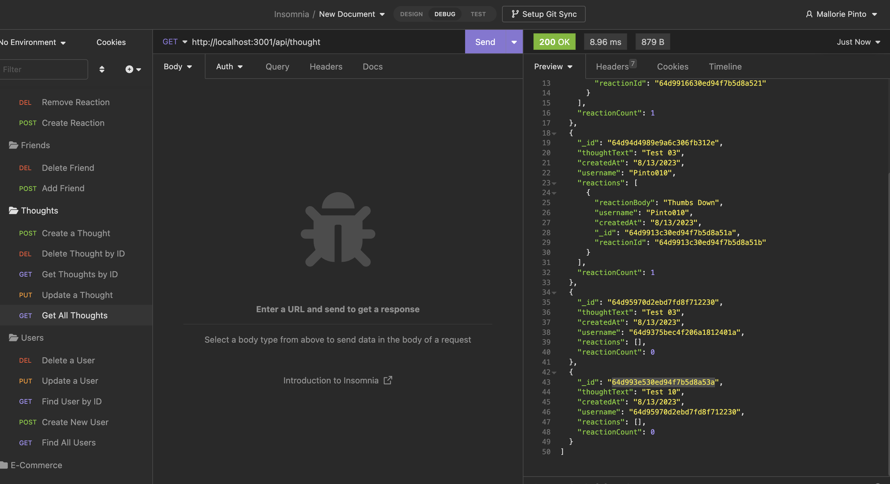

# social-network-api

## Description
This is an social network API application that allows the user to share thoughts, react to friends thoughts and develop a friend list.  This project is using Mongoose becuase social media apps typically hold a large amount of data and also need a simple way to organize all the data coming in. 

## Technologies 
The technologies that were used are listed below: 
    Express.js 
    Mongoose

## Installation

social network API URL:  https://github.com/Pinto006/social-network-api

video recording URL: https://drive.google.com/file/d/1upNnFcy7eBXCqBUW9UsYFtrPE8KoIwOb/view

## Usage
 Before using the command-line application npm i in the intergrated terminal. Once installed, type npm run start into the command-line in the termainal to start the server. You will no be able to test all the routes in Insomina. You can also see this demonstrated in the walkthrough video.  
 Users 
    Find all users 
    Find a user by ID 
    Update a user 
    Create a user 
    Delete a user
 Friends (connected to the user)
    Add a friend 
    delete a friend 
 Thoughts  
    Find all thoughts 
    Find a thought by ID 
    Update a thought 
    Create a thought 
    Delete a thought
 Reactions (connected to the thought)
    Add a reaction 
    delete a reaction 

## License

This project is licensed under MIT.
